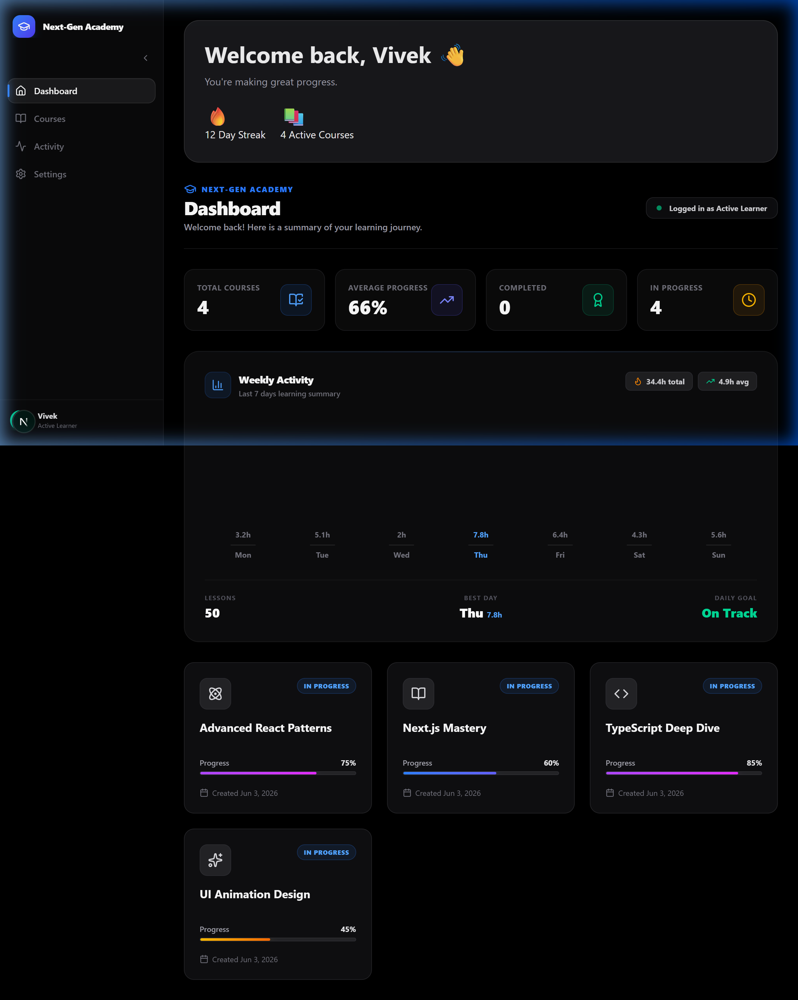
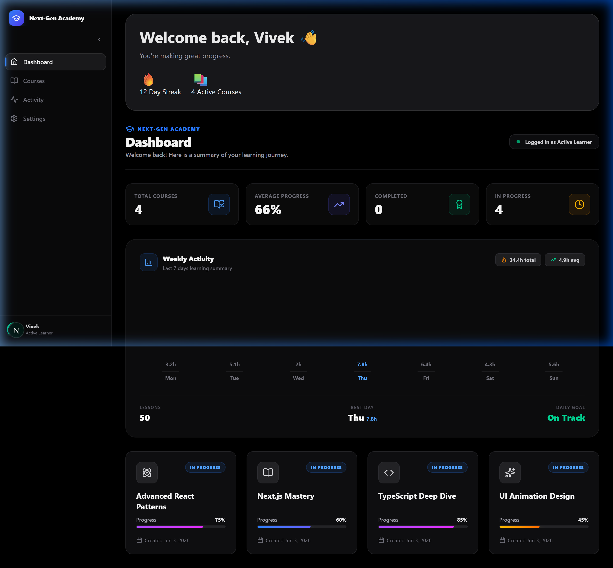
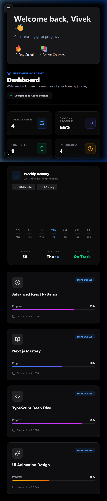

# 🎓 Next-Gen Learning Dashboard

A production-quality, real-time learning management dashboard built with **Next.js 15**, **Supabase**, **Framer Motion**, and **Tailwind CSS v4**. Features server-side data fetching, animated UI components, and a premium dark-theme SaaS aesthetic.

---

## 📋 Overview

Next-Gen Learning Dashboard is a modern web application that lets learners track course progress, visualize weekly activity, and manage their learning journey — all through a beautifully crafted, responsive interface.

### Key Highlights

- **Real-time course tracking** — progress bars, completion badges, and stats pulled live from Supabase
- **Animated interactions** — smooth spring-based animations powered by Framer Motion
- **Dark SaaS aesthetic** — glassmorphism, gradient accents, and micro-interactions throughout
- **Server-first architecture** — data is fetched on the server for fast initial loads and SEO
- **Responsive design** — works seamlessly from mobile (390px) to ultrawide desktop

---

## 🏗️ Architecture

```
next-gen-learning-dashboard/
├── src/
│   ├── app/                    # Next.js App Router
│   │   ├── layout.tsx          # Root layout (fonts, metadata)
│   │   ├── page.tsx            # Landing page
│   │   └── dashboard/
│   │       └── page.tsx        # Dashboard page (Server Component)
│   │
│   ├── actions/                # Server Actions
│   │   └── getCourses.ts       # Fetches courses from Supabase
│   │
│   ├── components/             # UI Components
│   │   ├── Sidebar.tsx         # Collapsible nav with layoutId animations
│   │   ├── DashboardHeader.tsx # Stats cards with staggered animations
│   │   ├── HeroCard.tsx        # Welcome greeting card
│   │   ├── ActivityChart.tsx   # Animated 7-day bar chart
│   │   ├── CourseGrid.tsx      # Staggered course card grid
│   │   ├── CourseCard.tsx      # Individual course card with hover effects
│   │   └── ProgressBar.tsx     # Animated progress bar (5 color variants)
│   │
│   ├── lib/
│   │   └── supabase/           # Supabase client configuration
│   │
│   ├── types/                  # TypeScript type definitions
│   │   └── course.ts           # Course interface
│   │
│   ├── hooks/                  # Custom React hooks
│   ├── providers/              # Context providers
│   ├── constants/              # App constants
│   ├── features/               # Feature modules
│   └── utils/                  # Utility functions
│
├── types/
│   └── course.ts               # Shared Course type definition
│
├── public/
│   └── screenshots/            # App screenshots for README
│
├── .env.example                # Environment variable template
├── next.config.ts              # Next.js configuration
├── tailwind.config.ts          # Tailwind CSS v4 configuration
├── tsconfig.json               # TypeScript configuration
└── package.json                # Dependencies & scripts
```

### Data Flow

```
┌─────────────┐     ┌──────────────────┐     ┌──────────────┐
│  Supabase   │────▶│  Server Action   │────▶│  Server      │
│  PostgreSQL │     │  getCourses()    │     │  Component   │
│  (courses)  │     │                  │     │  (page.tsx)  │
└─────────────┘     └──────────────────┘     └──────┬───────┘
                                                     │
                                              passes props
                                                     │
                              ┌───────────────────────┼──────────────────┐
                              ▼                       ▼                  ▼
                     ┌────────────────┐    ┌──────────────────┐  ┌──────────────┐
                     │ DashboardHeader│    │   CourseGrid     │  │ ActivityChart│
                     │ (Client)       │    │   (Client)       │  │ (Client)     │
                     │ Stats cards    │    │   ├─ CourseCard   │  │ Bar chart    │
                     │ with motion    │    │   └─ ProgressBar │  │ with motion  │
                     └────────────────┘    └──────────────────┘  └──────────────┘
```

---

## 🛠️ Tech Stack

| Technology | Version | Purpose |
|---|---|---|
| **Next.js** | 16.2.7 | React framework with App Router & Server Components |
| **React** | 19.2.4 | UI library |
| **TypeScript** | 5.x | Type safety |
| **Tailwind CSS** | 4.x | Utility-first styling |
| **Framer Motion** | 12.40.0 | Spring-based animations & layout transitions |
| **Supabase** | 2.107.0 | PostgreSQL database & authentication |
| **@supabase/ssr** | 0.10.3 | Server-side Supabase client for Next.js |
| **Lucide React** | 1.17.0 | Icon library |
| **Geist Font** | — | Typography (Sans & Mono) |

---

## ⚡ Server Components

The dashboard uses Next.js **Server Components** for the initial data fetch, keeping the client bundle lean:

### Server-Side (No JS shipped to client)

- **`app/dashboard/page.tsx`** — Fetches all courses from Supabase at request time using `getCourses()` server action. Renders error states, empty states, or passes data to client components.
- **`app/layout.tsx`** — Root layout with font loading and metadata.

### Client-Side (`"use client"`)

- **`Sidebar`** — Collapsible navigation with `layoutId` active indicator
- **`DashboardHeader`** — Computes stats (total, completed, in-progress, avg %) and renders animated stat cards
- **`CourseGrid` / `CourseCard`** — Staggered card animations with hover effects
- **`ActivityChart`** — Animated bar chart with spring physics
- **`ProgressBar`** — Animated width transition with 5 color variants

### Why This Split?

| Concern | Server | Client |
|---|---|---|
| Data fetching | ✅ `getCourses()` runs on server | — |
| SEO & initial paint | ✅ HTML rendered on server | — |
| Animations | — | ✅ Framer Motion requires client |
| Interactivity | — | ✅ Hover, click, collapse states |
| Bundle size | ✅ Zero JS for data logic | Minimal — only animation code |

---

## 🗄️ Supabase Setup

### 1. Create a Supabase Project

Go to [supabase.com/dashboard](https://supabase.com/dashboard) and create a new project.

### 2. Create the `courses` Table

Run this SQL in the Supabase SQL Editor:

```sql
CREATE TABLE courses (
  id UUID DEFAULT gen_random_uuid() PRIMARY KEY,
  title TEXT NOT NULL,
  progress NUMERIC NOT NULL DEFAULT 0,
  icon_name TEXT NOT NULL DEFAULT 'BookOpen',
  created_at TIMESTAMPTZ DEFAULT now()
);

-- Enable Row Level Security
ALTER TABLE courses ENABLE ROW LEVEL SECURITY;

-- Allow anonymous read access
CREATE POLICY "Allow public read access"
  ON courses
  FOR SELECT
  USING (true);
```

### 3. Insert Sample Data

```sql
INSERT INTO courses (title, progress, icon_name) VALUES
  ('Advanced React Patterns', 75, 'Code'),
  ('Next.js Mastery', 45, 'Globe'),
  ('TypeScript Deep Dive', 100, 'Terminal'),
  ('UI Animation Design', 30, 'Sparkles');
```

### 4. Configure Environment Variables

Copy `.env.example` to `.env.local` and fill in your credentials:

```bash
cp .env.example .env.local
```

```env
NEXT_PUBLIC_SUPABASE_URL=https://your-project.supabase.co
NEXT_PUBLIC_SUPABASE_ANON_KEY=your-anon-key-here
```

Find these values in **Supabase Dashboard → Settings → API**.

---

## 🚀 Deployment

### Local Development

```bash
# Install dependencies
npm install

# Start dev server
npm run dev

# Open in browser
# http://localhost:3000/dashboard
```

### Production Build

```bash
# Build for production
npm run build

# Start production server
npm start
```

### Type Checking & Linting

```bash
# Type check
npm run typecheck

# Lint
npm run lint
```

### Deploy to Vercel

1. Push your code to GitHub
2. Go to [vercel.com](https://vercel.com) and import the repository
3. Add environment variables:
   - `NEXT_PUBLIC_SUPABASE_URL`
   - `NEXT_PUBLIC_SUPABASE_ANON_KEY`
4. Click **Deploy**

> The app uses `export const dynamic = "force-dynamic"` on the dashboard route, ensuring fresh data on every request.

---

## 📸 Screenshots

### Dashboard View



### Desktop View



### Mobile View



---

## 📄 License

MIT
